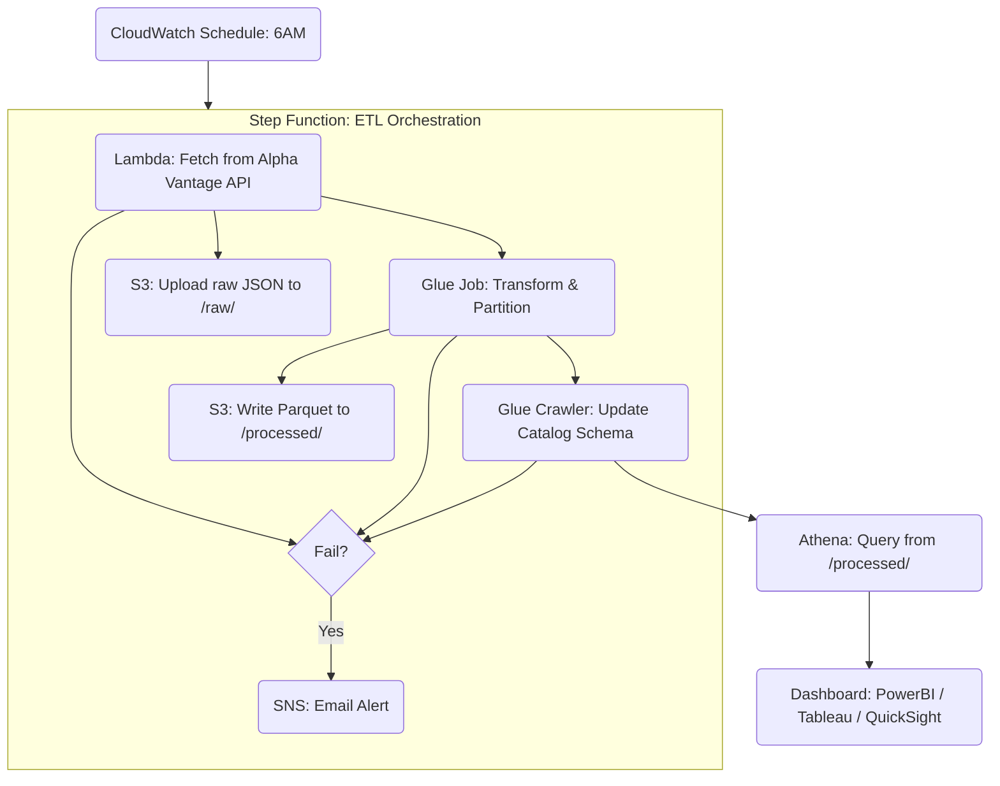

# AWS Serverless ETL Pipeline with Terraform

An end-to-end serverless data pipeline using AWS Lambda, AWS Glue, S3, Step Functions, and Athena, fully provisioned using Terraform.

This pipeline extracts stock data from the Alpha Vantage API, transforms it into a structured format using PySpark, stores it as Parquet in S3, and makes it queryable via Athena. It is orchestrated via AWS Step Functions with alerting and retry logic.

---
## Features
- Daily Scheduled ETL Job via CloudWatch Event Rule
- Serverless with Lambda, Glue, Step Functions
- Modular Terraform Infrastructure
- IAM with least privilege principle
- Data transformation using PySpark in AWS Glue
- Partitioned Parquet output in S3 (symbol, date)
- Schema detection using Glue Crawler
- Error notifications via SNS Email
- Queryable with Athena (and compatible with QuickSight, Power BI)

## Architecture:


## Step Function Flow


If a node fails, it is caught and an SNS Notification is sent to notify of the failure:


## Tech Stack

| Layer               | Technology                             |
|---------------------|-----------------------------------------|
| Orchestration       | AWS Step Functions                      |
| Compute             | AWS Lambda, AWS Glue                    |
| Storage             | Amazon S3                               |
| Transformation      | PySpark                                 |
| Metadata Catalog    | AWS Glue Data Catalog                   |
| Scheduling          | CloudWatch Event Rule                   |
| Alerting            | Amazon SNS                              |
| Query Layer         | Amazon Athena                           |
| Infrastructure      | Terraform (modular architecture)        |


---

## Terraform Module Structure
```
terraform/
  ├── modules/
  │   ├── lambda/
  │   ├── glue/
  │   ├── crawler/
  │   ├── s3/
  │   ├── step_function/
  │   ├── sns/
  │   └── iam/
  └── main.tf (root)
```
---

## Setup

1. Clone this repository

```bash
git clone https://github.com/your-username/aws-etl-pipeline.git
cd aws-etl-pipeline
```

2. Fill in Secrets

Edit secrets.auto.tfvars:
```
alphavantage_api_key = "your_api_key"
stock_symbol         = "AAPL"
```
3. Initialize Terraform

`terraform init`

4. Apply Terraform Plan

`terraform apply`

All resources will be provisioned, including IAM roles, Lambda, Glue, Step Functions, and S3.

## 💸 Cost Estimate

> [!IMPORTANT]  
> This project provisions real AWS infrastructure and may incur costs in your AWS account. You are responsible for monitoring and cleaning up resources if not in use.

This pipeline is optimized for low-cost, daily ETL jobs.

| Frequency | Approximate Cost |
|-----------|------------------|
| Per run   | ~$0.035 (3.5 cents) |
| Daily     | ~$0.035/day |
| Monthly   | ~$1.05/month (assuming 1 run per day) |


## Output Data
- Raw: s3://mycompany-data-pipeline-dev-xxxxx/raw/
- Processed: s3://mycompany-data-pipeline-dev-xxxxx/processed/
- Partitioned by symbol and date

## Athena Table Example

```sql
SELECT * FROM stock_data.data_pipeline_processed
WHERE symbol = 'AAPL'
ORDER BY timestamp DESC
LIMIT 10;
```
Output:  


## Error Handling

Each step in the pipeline (Lambda, Glue Job, Glue Crawler) is wrapped with Catch logic in Step Functions. On failure, an SNS Email Notification is triggered.

You can configure SNS to target other services like Slack, PagerDuty, or SMS.


## Schedule

Runs every day at 6:00 AM (UTC/local depending on timezone) via CloudWatch Event Rule.

## Dashboarding

The final output table is queryable from Athena and compatible with:
- AWS QuickSight
- Power BI (via ODBC)
- Tableau
- Jupyter Notebooks with PyAthena

## Security & IAM
- Every service uses a least-privilege IAM role
- Terraform manages all IAM resources
- iam/ module contains granular policies per service (Lambda, Glue, Step Functions)

### Required IAM Permissions

To provision this project, you need an AWS IAM role or user with sufficient permissions to create the following services:
- AWS Lambda
- AWS Glue (jobs, crawlers, databases)
- S3 (buckets, objects)
- Step Functions (state machines)
- CloudWatch (logs, events)
- IAM (role creation and iam:PassRole)

For quick setup, you can temporarily attach the AWS-managed AdministratorAccess policy:
```arn:aws:iam::aws:policy/AdministratorAccess```

> [!Note]  
> For production use, it’s recommended to create a scoped-down IAM policy.

## Possible Enhancements
- Use AWS Secrets Manager for sensitive values
- Add unit tests for Lambda / Glue
- Add retry and exponential backoff logic to Lambda
- Add QuickSight Dashboard directly in Terraform


## Author

Hardy Fenam  
Cloud & Data Engineer   

---

Copyright © 2025 Hardy Fenam
All Rights Reserved.
